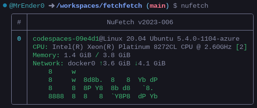

# NuFetch



[](https://gitpod.io/#https://github.com/MrEnder0/nufetch)

This is an [NuShell](https://github.com/nushell/nushell) recreation of [Neofetch](https://github.com/dylanaraps/neofetch).

## Installation

This is supported on Windows and Linux due to [NuShell](https://github.com/nushell/nushell) being cross platform.

### Windows

Download the nushell.nu and nushell_config.nu files and put them in your NuShell config folder.

<sub><sup><sub><sup> I was too lazy to make a windows install script so you have to do it on your own or just run it portably... </sup></sub></sup></sub>

### Linux

Make sure you have [NuShell](https://github.com/nushell/nushell) and [Curl](https://github.com/curl/curl) installed.

```bash
curl -s https://raw.githubusercontent.com/MrEnder0/nufetch/master/scripts/install_linux.sh | bash
```
